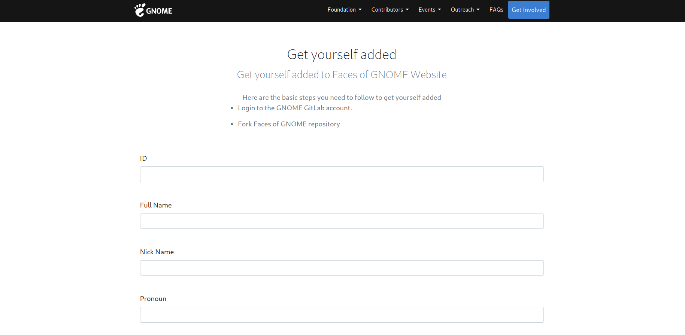
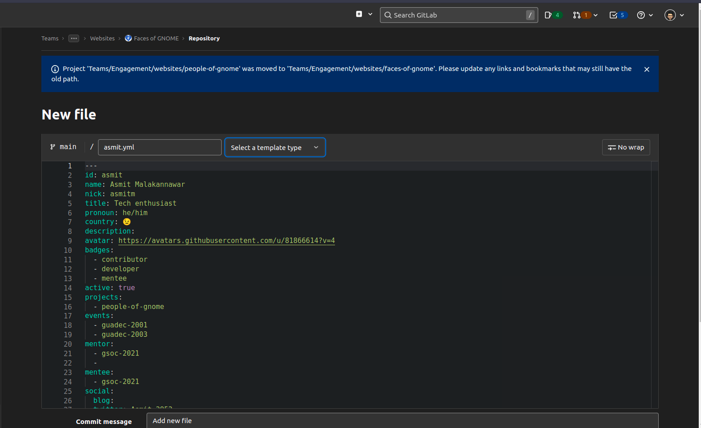

% Faces Of GNOME
% Asmit Malakannawar (`asmitbm2952002@gmail.com`)
% July 22, 2022

## **Faces Of GNOME**

**Mentors**: Claudio Wunder(`@ovflowd`), Caroline Henriksen(`@chenriksen`)

**Objective**: Continuing the Development of the Platform

**Repository Link**: gitlab.gnome.org/Teams/Engagement/websites/faces-of-gnome

**Blog**: medium.com/@asmit2952

## About Me

- I'm Asmit Malakannawar
- I'm from Pune, India
- A sophomore pursuing B.Tech in CSBS
- I'm an Open Source enthusiast and love interacting with various communities
- Connect with me on Twitter: @Asmit_2952

## About Project

Faces of GNOME initiative is a Foundation-led effort to advocate contributors and recognise their ongoing and previous contributions to the GNOME project.

**GNOME** has all kinds of people:

- Designers
- Developers
- Translators
- Moderators
- Speakers
- Interns

## Current Progress

- Changed styles
- Updated packages
- Fixed accesibilty errors

{ width=400px }

## 

## Future scope

- Populate FAQs page with actual content
- Creating Wiki/Documentation pages 
- Replacing existing jQuery with Vanilla JavaScript
- UI/UX improvements
- Experimenting with other Static Site Generators

# Thank you <3